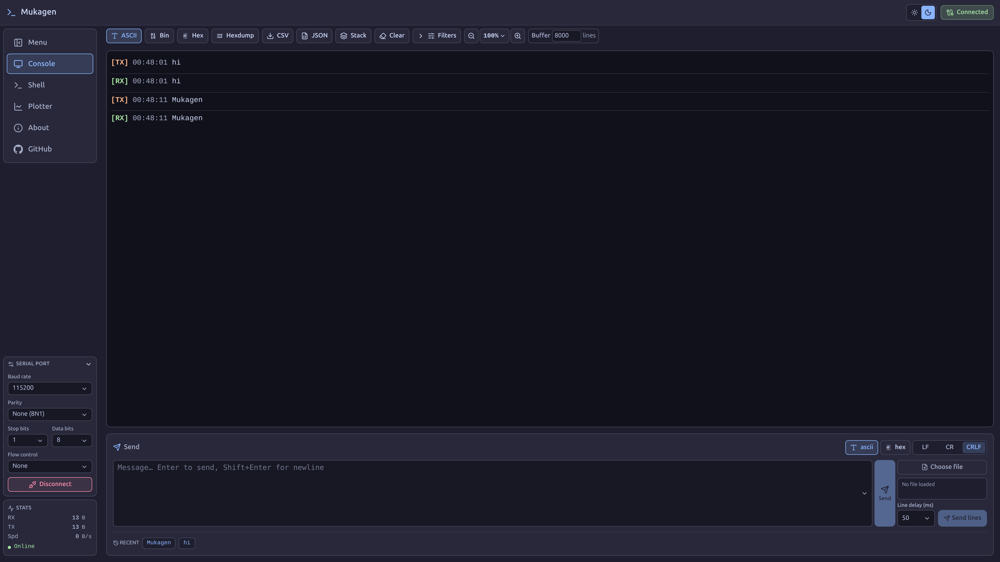
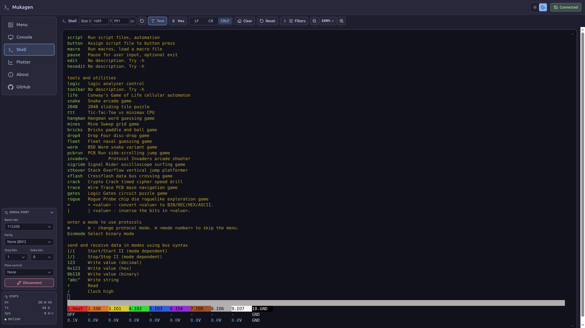
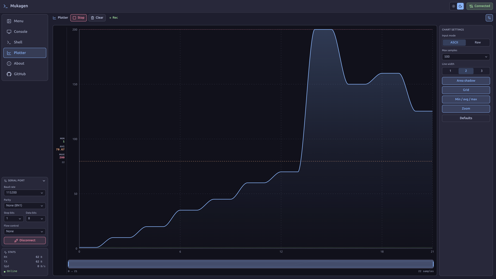

<h1 align="center">Mukagen</h1>
<p align="center">
  <strong>Modern Serial Terminal & Telemetry Dashboard</strong><br>
  <i>A professional, high-performance web-based tool for engineers, hardware hackers, and developers working with embedded systems and industrial serial protocols.</i>
</p>

<p align="center">
  
  
  
</p>

<p align="center">
  Mukagen leverages the <b>Web Serial API</b> to provide a seamless, driverless experience directly in modern browsers (Chrome, Edge, Opera) — no native apps required.
</p>

<p align="center">
  
  
  
</p>

---

### Try Mukagen — Live Demo

<p align="center">
  <a href="https://reza-bakhshi.github.io/Mukagen/" target="_blank">
    
  </a>
</p>

<p align="center">
  <a href="https://reza-bakhshi.github.io/Mukagen/" target="_blank" style="text-decoration:none;font-weight:600">Open Mukagen →</a>
</p>

---

## 📑 Table of Contents

- [Getting Started](#-getting-started)
- [Key Features](#-key-features)
  - [Serial Configuration](#-serial-configuration)
  - [Main Views](#%EF%B8%8F-main-views)
  - [UART Transmission](#-uart-transmission-send-panel)
  - [Personalization \& UX](#-personalization--ux)
- [Complete Tutorial](#-complete-tutorial-working-with-the-dashboard)
- [Hardware \& Shell Guide](#-hardware--interactive-shell-guide)
- [License](#-license)

---

## Installation & Build

## 🏁 Getting Started

### Prerequisites

- A modern browser that supports the [Web Serial API](https://developer.mozilla.org/en-US/docs/Web/API/Web_Serial_API) (Google Chrome, Microsoft Edge, or Opera).
- **Node.js** (for local development).

```bash
# 1. Clone the repository
git clone https://github.com/reza-bakhshi/Mukagen

# 2. Install dependencies
npm install

# 3. Start development server
npm run dev

# 4. Build for production (outputs to dist/ directory)
npm run build
```

---

## 🚀 Key Features

### 📡 Serial Configuration

Take full control over hardware communication parameters before you connect:

- **Baud Rate:** Standard (9600 to 921600) rates supported.
- **Data Bits:** 7 or 8 bits.
- **Stop Bits:** 1 or 2 bits.
- **Parity:** None, Even, or Odd.
- **Flow Control:** None or Hardware (RTS/CTS).

### 🖥️ Main Views

#### 1. Console Monitor

High-fidelity data monitoring with advanced capture capabilities.

- **Display Formats:**
  - **ASCII:** Classic text-based output.
  - **Bin:** Raw binary representation.
  - **Hex:** Space-separated hexadecimal bytes.
  - **Hexdump:** Industry-standard hexdump view with address offsets and ASCII sidebar.
- **Advanced Filtering:**
  - **Text Search:** Real-time fuzzy matching across ASCII, Hex, and Binary representations.
  - **Hex Pattern:** Targeted filtering for specific byte sequences (e.g., `AA 55`).
  - **Directional Filter:** Isolate **RX** (Received), **TX** (Transmitted), or view **All** data.
  - **Byte Length Filter:** Filter packets by minimum/maximum size (e.g., only show packets > 10 bytes).
  - **ASCII Only:** Smart filter to hide noise/binary blobs and show only mostly-printable data.
- **Session Management:**
  - **Buffer Limit:** Configurable history from 500 up to 50,000 lines.
  - **Auto-Scroll:** Toggle automatic following of the latest data.
  - **Stack View:** Toggle layered layout for dense monitoring.
  - **Export:** Save your capture history to **CSV** or **JSON** for offline analysis.

#### 2. Interactive Shell

A full-featured **xterm.js** terminal emulator integrated right into the dashboard.

- **Display Modes:** Seamlessly toggle between Text and Hex monitoring.
- **Scaling:** Dynamic **Text Zoom** to adjust font size for accessibility or density.
- **Responsive Sizing:** Manually resize the terminal panel or use **Auto-fill** to maximize your workspace.
- **Terminal Reset:** One-click button to clear display and send recovery commands (`Ctrl+C`, `reset`, `stty sane`) to the remote device.
- **Receive Filtering:** Real-time string matching to isolate specific logs directly in the shell.

#### 3. Telemetry Plotter

Visualize real-time data from your sensors or internal logic.

- **Input Modes:**
  - **ASCII:** Line-based parsing (e.g., device sends `23.5\n`).
  - **Raw:** High-speed binary parsing using 64-bit IEEE-754 `double` samples (one value per 8 bytes, little-endian).
- **Visualization Options:**
  - **Max Samples:** Adjustable buffer size (100 to 10,000 points).
  - **Stroke Customization:** Adjustable line thickness (1px to 3px).
  - **Area Fill:** Optional shadow/gradient under the waveform for better visibility.
  - **Grid & Reference Lines:** Toggle background grids and Min/Avg/Max reference markers.
- **Interactive Tools:**
  - **Mouse Zoom:** Zoom into specific time windows using the scroll wheel.
  - **Live Statistics:** Real-time calculation of Minimum, Maximum, Average, and Sample Count.

### 📤 UART Transmission (Send Panel)

Powerful tools for sending data back to your hardware.

- **Formats:** Send data as **ASCII** text or **Hex** byte sequences.
- **Line Endings:** Selectable `LF`, `CR`, or `CRLF` suffixes.
- **Command History:** Stores up to 32 recent commands for quick re-transmission.
- **Sending Multiple Lines with Delay:**
  - Load `.txt`, `.log`, or `.csv` files.
  - **Line Delay:** Configurable delay (0ms to 60s) between lines to prevent buffer overflow on the target device.
  - Track progress with built-in batch transmission monitoring.

### 🎨 Personalization & UX

- **Theme Support:** Switch between **Dark** and **Light** modes to suit your environment.
- **Collapsible Sidebar:** Maximize terminal space while keeping real-time stats visible.
- **Real-time Metrics:** Persistent dashboard showing:
  - Total Bytes Received (RX) & Transmitted (TX).
  - Current Transfer Speed (B/s, KB/s).
  - Port Status (Online/Offline).
- **Persistence:** All settings, filters, and UI preferences are automatically saved to your browser's local storage.

---

## 📖 Complete Tutorial: Working with the Dashboard

### Step 1: Connect Your Device

1. **Open the Dashboard** in a supported browser (Chrome, Edge, Opera).
2. **Configure serial parameters** to match your device:
   - Set **Baud Rate** (commonly `9600` or `115200` for Arduino/ESP32).
   - Set **Data Bits** (usually `8`).
   - Set **Stop Bits** (usually `1`).
   - Leave **Parity** and **Flow Control** as default unless your device requires otherwise.
3. **Click "Connect"** in the bottom-left corner.
4. **Select your serial device** from the browser dialog (e.g., `/dev/ttyUSB0`, `COM3`, etc.).
5. **Click "Connect"** — the port status will show "Connected" in the header!

### Step 2: Monitor Serial Data (Console View)

Once connected, data from your device appears in real-time. Use the tools below to make sense of the stream:

- **Display Mode:** Choose **ASCII** for readable text (debug logs), **Hex** for raw bytes (binary protocols), or **Hexdump** for structured byte layout with offsets.
- **Filter & Search:**
  - Type keywords into **Text Search** (e.g., `ERROR`) to filter messages.
  - Use **Hex Pattern** for byte sequences (e.g., `AA 55`).
  - Use **Direction Filter** to isolate `RX` (received), `TX` (sent), or `All`.
  - Enable **ASCII Only** to hide binary noise, or use **Byte Length** to hide packets that are too small (e.g., < 5 bytes).

> **Example: Monitoring a GPS Module (NEO-6M)**  
> GPS modules output NMEA sentences like this:
>
> ```text
> $GPRMC,123519,4807.038,N,01131.000,E,022.4,084.4,230394,003.1,W*6A
> $GPGGA,123519,4807.038,N,01131.000,E,1,08,0.9,545.4,M,46.9,M,,*47
> ```
>
> *How to monitor:* Set Display Mode to **ASCII** $\rightarrow$ Type `$GP` in Text Search to show only GPS fix sentences $\rightarrow$ Enable **Auto-Scroll** $\rightarrow$ Watch the RX speed in the sidebar!

### Step 3: Send Data (UART Transmission)

Use the **Transmit Panel** to send commands back to your device manually or via automated files.

**Manual Commands:**

1. Type your command (e.g., `AT+CGSN`).
2. Choose format (**ASCII** or **Hex**) and **Line Ending** (`LF`, `CR`, or `CRLF`).
3. Press **Enter** or click **Send**. The command appears in the console with a **TX** badge.

> 💡 **Pro Tip:** The **Recent** (history) list in the Transmit Panel shows up to 32 previously-sent messages. Click any message in the list to re-send it instantly!

**Sending Multiple Lines with Delay:**
Sending data too fast can overflow your device's buffer. Fix this by uploading a file and adding a delay between lines.

1. Click **"Upload File"** and select a `.txt`, `.log`, or `.csv` file.
2. Adjust the **Line Delay** (in milliseconds):
   - **0 ms:** Send as fast as possible.
   - **50 ms:** Good for slightly slower devices.
   - **200 ms:** Recommended for AT commands.
   - **500 ms:** Safe for strictly buffer-limited or low-power devices.
3. Click **"Send [N] Lines"**. Monitor the progress in real-time as TX badges appear in the console.

> **Example: Configuring a GSM Module (SIM800L)**  
> Create a file `gsm_config.txt` with these lines:
>
> ```text
> ATE1
> AT+CPIN?
> AT+CREG?
> AT+CSQ
> AT+CCID
> AT+CGSN
> ```
>
> *In the Dashboard:* Upload the file $\rightarrow$ Set Line Ending to **CRLF** $\rightarrow$ Set Line Delay to **200 ms** $\rightarrow$ Click **"Send 6 Lines"**. All commands are sent automatically with perfect timing!

### Step 4: Visualize Sensor Data (Plotter)

Graph real-time readings by switching to the **Plotter View**.

- **ASCII Mode:** Device sends newline-delimited numbers (e.g., `23.5` or `{"temp": 23.5}`). The dashboard extracts the numeric value and plots it.
- **Raw Mode:** Device sends 8-byte IEEE-754 `double` values (little-endian). The plotter reads one `double` per 8 bytes.

> **Example: Temperature Sensor (Arduino)**  
>
> ```cpp
> float temp = readTemperature();
> Serial.println(temp);  // Sends "23.5\n"
> delay(1000);           // Once per second
> ```
>
> *In the Dashboard:* Switch to **Plotter View** $\rightarrow$ Set Input Mode to **ASCII** $\rightarrow$ Adjust **Max Samples** if it scrolls too fast $\rightarrow$ Enable **Grid** and **Reference Lines** $\rightarrow$ Use **Mouse Zoom** to inspect data.

> 💡 **Note on Multi-Axis Sensors:** If your device streams `x,y,z` coordinates (e.g., `9.2,0.1,-9.8`), note that the Plotter currently visualizes a single value stream. Send one sensor axis at a time for accurate plotting.

### Step 5: Export & Analyze Data

1. Click **"Export Data"** in the Console view.
2. Choose **CSV** (tab-separated, great for Excel) or **JSON** (structured for programming).
3. The file downloads directly to your computer for offline analysis.

### Step 6: Advanced Layout Features

- **Auto-Scroll & Stack View:** Turn Auto-Scroll OFF to freeze the view and inspect a message. Toggle Stack View for a compact, multi-line layout.
- **Terminal Reset:** Clears the shell display and sends `Ctrl+C` + `reset` commands to reconnect with an unresponsive device.
- **Resize Shell / Text Zoom:** Drag the boundary to adjust terminal height, click **"Auto-fill"** to maximize, and use **+/−** to adjust font accessibility.

---

## 🔌 Hardware & Interactive Shell Guide

The dashboard includes a full-featured interactive shell (xterm) that behaves like a terminal connected directly to your device's UART. It is perfect for interacting with boot messages, login shells, and command-line interfaces.

### Safety & Best Practices
>
> ⚠️ **WARNING - HARDWARE WIRING:**
>
> - **Voltage Matching:** ALWAYS use a USB–TTL serial adapter that matches your device's logic voltage. **Do NOT** use 5V TTL adapters on 3.3V devices.
> - **Connections:** Connect Adapter TX $\rightarrow$ Device RX; Adapter RX $\rightarrow$ Device TX; and **GND $\rightarrow$ GND**.
> - **Grounding:** Use short, solid ground connections to avoid floating references.
> - **ESD:** Follow standard ESD precautions and power isolation protocols when working with live environments.

### Using the Shell

1. Attach your USB–TTL adapter, open the dashboard, and click **Connect**.
2. Select your device and ensure your **Baud Rate, Data Bits, Stop Bits, and Parity** are exactly matched to the target.
3. Open the **Shell** view. You should see incoming data.
4. Press **Enter** or type at the prompt to interact!
5. **Shortcuts:** Use `Ctrl+C` to interrupt processes, send scripted files via the Transmit Panel using `Line Delay`, or paste large commands directly into the input field.

### Troubleshooting

- **No output:** Check your TX/RX wiring (they might need to be swapped). Ensure the device is powered and the correct browser port is selected.
- **Garbage characters:** Double-check your **Baud Rate** and **Line Ending** settings.
- **Permission denied (Linux Hosts):** Ensure your current user is added to the `dialout` group, or run the browser with the appropriate permissions to access `/dev/tty*` devices.

---

## 📝 License

This project is licensed under the **GNU** License.
